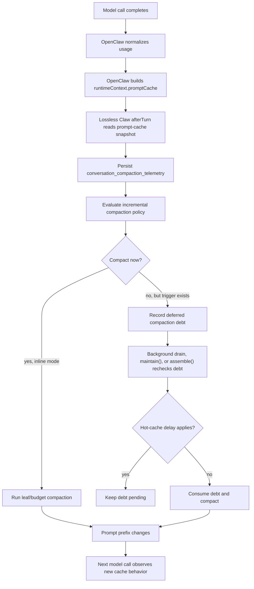

# Cache-Aware Compaction

This document is the reference model for how Lossless Claw should preserve
provider prompt-cache value while still compacting before the transcript becomes
dangerously large. It describes the current implementation, the terms used in
the code, the lifecycle of cache telemetry and compaction debt, and the target
policy we want after the cold-cache debt behavior is corrected.

Some sections are intentionally aspirational. Where the code currently differs
from the target policy, the document calls that out explicitly.

## Goals

Cache-aware compaction has three goals:

- Preserve hot provider prompt caches when context pressure is modest.
- Compact aggressively enough that sessions do not drift into emergency
  overflow handling as their only practical maintenance path.
- Keep every decision observable and bounded, so a bad or missing cache signal
  cannot strand compaction forever.

The core tension is that compaction rewrites the prompt prefix. For
mutation-sensitive prompt-cache families, rewriting the prefix can invalidate a
cache that would otherwise make the next model call much cheaper and faster.
Lossless Claw therefore treats compaction as prompt mutation, not just database
maintenance.

## Non-Goals

Cache-aware compaction does not try to perfectly model provider internals.
Provider cache implementations differ, routing can move a request to a different
backend, and OpenClaw may only have normalized usage rather than a provider's
full cache state. The policy should be conservative and robust, not exact.

Cache-aware compaction also does not reduce Lossless Claw's losslessness
requirements. It can defer, summarize, or externalize old material according to
normal Lossless Claw rules, but it must not discard persisted user data.

## Glossary

**Prompt cache**: A provider-side cache of a stable prompt prefix. If a later
request reuses that prefix, the provider may report some prompt tokens as cache
read instead of newly processed input.

**Prompt prefix**: The stable front portion of the model request. Summaries,
older messages, system additions, tools, provider transport, and model routing
can all affect whether a provider considers the prefix reusable.

**Prompt mutation**: Any local change that changes the prompt sent to the
provider. Leaf compaction and condensed compaction are prompt mutations because
they replace raw history or lower-level summaries with newly generated summary
content.

**Mutation-sensitive cache family**: A provider/model family where preserving a
stable prompt prefix is valuable and local prompt rewrites are likely to break
cache reuse. Lossless Claw currently treats Anthropic/Claude, OpenAI GPT and
o-series models, OpenAI Codex, GitHub Copilot, Codex CLI, and related identifier
variants as mutation-sensitive.

**Cache read**: Normalized usage tokens that the provider says were read from
cache for the most recent API call.

**Cache write**: Normalized usage tokens that the provider says were written to
cache for the most recent API call.

**Prompt token count**: For cache decisions, Lossless Claw computes this from
the most recent normalized usage as `input + cacheRead + cacheWrite`. This is a
prompt-side count, not output tokens.

**Cache read share**: `cacheRead / promptTokenCount`. Lossless Claw currently
treats observations below 20 percent as weak cache reuse. Weak reuse can mean
the cache broke, the request routed differently, the prompt shape changed, or
the provider did not report cache usage in the expected form.

**Hot cache**: Lossless Claw's effective belief that mutating the prompt now
would probably waste a still-useful cache. A hot cache can come from a positive
cache read, a cache write, a recent cache touch timestamp, or hysteresis after a
recent hot observation.

**Cold cache observation**: A retrospective observation that the last model call
got little or no cache reuse. This is about the last call's experience, not
necessarily the state of the cache after that call completed.

**Cold cache state**: Lossless Claw's effective belief that prompt mutation is
less costly now because the cache is not useful enough to preserve. This can be
caused by an explicit cache break, repeated cold observations, or sufficiently
low cache read share.

**Cache touch**: Evidence that the cache was read from or written to. OpenClaw
passes `promptCache.lastCacheTouchAt` when it can identify the assistant turn
timestamp or a runtime-managed cache TTL timestamp.

**Retention**: The runtime-resolved cache retention class for the provider/model
path. Lossless Claw maps `long` and `1h` to one hour, `none` to no usable cache,
and all other known non-none classes to `cacheAwareCompaction.cacheTTLSeconds`.

**Cache TTL**: Lossless Claw's local estimate of how long a cache touch remains
worth preserving. The fallback default is 300 seconds.

**Leaf compaction**: The pass that replaces old raw messages outside the fresh
tail with a depth-0 summary.

**Condensed compaction**: A pass that merges lower-depth summaries into a
higher-depth summary.

**Fresh tail**: The newest raw messages that remain protected from leaf
compaction so recent interaction detail stays literal.

**Raw tokens outside tail**: Token estimate for raw messages old enough to be
eligible for leaf compaction.

**Leaf trigger**: The threshold comparison that asks whether raw tokens outside
the fresh tail are large enough to justify a leaf compaction pass.

**Budget trigger**: The threshold comparison that asks whether the assembled or
observed current prompt is too close to the configured token budget.

**Deferred compaction debt**: A durable row in
`conversation_compaction_maintenance` saying compaction should run later. This
is used when after-turn policy sees that compaction is needed but foreground
execution should not mutate the prompt immediately.

**Cold-cache catch-up**: A bounded compaction mode used when the effective cache
state is cold. It can run more than one leaf pass, up to
`cacheAwareCompaction.maxColdCacheCatchupPasses`, so the system catches up after
deferring during a hot-cache period.

**Critical pressure**: A high token-budget pressure threshold where avoiding
overflow is more important than preserving cache. The current default is
`criticalBudgetPressureRatio = 0.90`.

## High-Level Lifecycle



The most important design point is that the model call both observes the old
cache state and can warm or refresh the new cache state. That means "the last
call was cold" and "the cache is cold now" are not the same statement.

## OpenClaw Telemetry Plumbing

OpenClaw owns provider dispatch and has the best view of the most recent model
call. It passes that information to context engines through
`ContextEngineRuntimeContext.promptCache`.

The OpenClaw type is `ContextEnginePromptCacheInfo`, with these fields:

- `retention`: runtime-resolved retention class.
- `lastCallUsage`: normalized most-recent-call usage.
- `observation`: OpenClaw's cache observability result, including whether a
  cache break was detected and what changed.
- `lastCacheTouchAt`: runtime timestamp for the most recent cache touch.
- `expiresAt`: known expiry timestamp when the runtime can source it
  confidently. Lossless Claw does not currently consume this field.

Ignoring `expiresAt` is a meaningful gap. When the runtime can provide a
confident expiry timestamp, that timestamp is a better hot-cache deadline than
Lossless Claw's reconstructed `lastCacheTouchAt + retention-derived TTL`
estimate. The fallback TTL path remains necessary when expiry is unknown, but
it should not override a runtime-sourced expiry.

The pi embedded runner builds the value after the attempt completes:

- It finds the assistant message for the current attempt.
- It normalizes usage into `input`, `output`, `cacheRead`, `cacheWrite`, and
  `total`.
- It builds a cache observation when cache observability is enabled and either a
  break was detected, prompt-cache changes were seen, or cache-read usage was
  reported.
- It resolves a cache-touch timestamp from the assistant message timestamp when
  the last call had cache usage, otherwise from runtime cache-TTL bookkeeping.
- It passes this through `runtimeContext.promptCache` to Lossless Claw lifecycle
  hooks.

This means Lossless Claw does not infer provider usage directly from raw
transcripts. It consumes normalized, runtime-owned telemetry.

## Lossless Claw Telemetry Storage

Lossless Claw persists cache and compaction state in
`conversation_compaction_telemetry`. The key fields are:

| Field | Meaning |
| --- | --- |
| `last_observed_cache_read` | Most recent normalized cache-read token count. |
| `last_observed_cache_write` | Most recent normalized cache-write token count. |
| `last_observed_prompt_token_count` | Most recent prompt-side token count used for read-share math. |
| `last_observed_cache_hit_at` | Time Lossless Claw classified a snapshot as hot. |
| `last_observed_cache_break_at` | Time Lossless Claw observed an explicit cache break. |
| `cache_state` | Last direct snapshot classification: `hot`, `cold`, or `unknown`. |
| `consecutive_cold_observations` | Count of consecutive non-explicit cold snapshots. |
| `retention` | Runtime cache retention class. |
| `last_leaf_compaction_at` | Last successful leaf-producing compaction. |
| `turns_since_leaf_compaction` | Refill counter for dynamic leaf sizing. |
| `tokens_accumulated_since_leaf_compaction` | Raw-token refill counter for dynamic leaf sizing. |
| `last_activity_band` | Dynamic leaf-sizing band: `low`, `medium`, or `high`. |
| `last_api_call_at` | Time Lossless Claw updated telemetry for a model call. |
| `last_cache_touch_at` | Best-known cache touch timestamp. |
| `provider` | Runtime provider identifier. |
| `model` | Runtime model identifier. |

There is currently no stored `expires_at` field. That means Lossless Claw can
only reconstruct expiry from `retention`, `cacheTTLSeconds`, and the latest
cache touch. The target design should persist a runtime-provided expiry when
OpenClaw supplies one, then use it as the primary clock for hot-cache delay and
cold-debt drain eligibility.

Telemetry is updated in `afterTurn` before incremental compaction policy is
evaluated. If `runtimeContext.promptCache` is missing, Lossless Claw still
updates raw-token refill counters when it has raw-tail data.

## Snapshot Classification

Lossless Claw first converts `runtimeContext.promptCache` into a snapshot:

- `observation.broke === true` means the snapshot is cold.
- Positive `cacheRead` means the snapshot is hot.
- Positive `cacheWrite` also means the snapshot is hot, because the call has
  just written a reusable cache prefix.
- Any cache usage or observation signal with no read/write and no explicit
  break is treated as cold.
- Missing prompt-cache information is unknown.

This snapshot is a direct reading of the last call. It is then persisted and
combined with older telemetry to produce the effective state used by policy.

## Effective Cache State

`resolveCacheAwareState()` turns stored telemetry into the effective state used
by incremental compaction:

1. Missing telemetry is unknown.
2. Very low cache read share is cold.
3. A directly stored hot state is hot.
4. Hot-cache hysteresis can keep the state hot after a recent hit.
5. An explicit cache break newer than any hit or touch is cold.
6. Repeated cold observations at or above
   `coldCacheObservationThreshold` are cold.
7. Any prior cache hit is hot.
8. A stored cold state without enough confirmation falls back to unknown.

The order matters. Low cache read share is intentionally allowed to override a
nominally hot state because a tiny read against a huge prompt often behaves like
a broken cache from the cost and latency perspective.

## Hot-Cache Delay

Deferred compaction debt is gated by
`shouldDelayPromptMutatingDeferredCompaction()`. The current gate delays when:

- cache-aware compaction is enabled;
- current prompt pressure is below the critical pressure threshold;
- provider/model telemetry is from a mutation-sensitive cache family;
- no fresh explicit cache break is newer than the latest cache touch signal;
- the last cache touch is still inside the effective TTL window.

The TTL touch source is:

1. `lastCacheTouchAt`;
2. `lastObservedCacheHitAt`;
3. `lastApiCallAt`.

The target gate should first check a runtime-provided `expiresAt` when one is
available and trustworthy:

```text
if expiresAt is present:
  hot while now < expiresAt
else:
  hot while now < resolved_touch_time + resolved_ttl
```

This fallback chain intentionally treats recent API activity for
mutation-sensitive families as cache-relevant when explicit telemetry is weak.
That is conservative for cache preservation, but it also creates the risk of
starving compaction in a very active session.

## Incremental Compaction Policy

`evaluateIncrementalCompaction()` decides whether after-turn maintenance should
compact or record debt.

The current policy is:

1. Resolve effective cache state.
2. Resolve dynamic leaf chunk bounds and activity band.
3. Evaluate the leaf trigger against raw tokens outside the fresh tail.
4. If the leaf trigger is not met, do not compact.
5. If the budget trigger is met, compact with budget-trigger catch-up passes.
6. If cache is hot and real token-budget headroom is comfortable, skip
   compaction with reason `hot-cache-budget-headroom`.
7. If cache is hot and raw-tail pressure is below
   `hotCachePressureFactor * leafTrigger.threshold`, skip compaction with
   reason `hot-cache-defer`.
8. Otherwise compact. Cold cache uses reason `cold-cache-catchup` and bounded
   catch-up passes. Hot cache uses leaf-only compaction if pressure finally
   justifies mutation.

When hot-cache compaction still runs, follow-on condensed passes are suppressed.
That keeps the mutation scope limited to the leaf pass whose pressure justified
the cache break.

## Deferred Debt Lifecycle

Deferred debt is stored in `conversation_compaction_maintenance`. There is one
coalesced row per conversation, not a queue.

The row records:

- whether debt is pending or running;
- `requested_at`;
- the debt `reason`;
- last started and finished times;
- last failure summary;
- the token budget and current token count known when debt was recorded.

Debt can be consumed from three paths:

- **Background drain** after `afterTurn`, only when the session queue is idle.
- **`maintain()`**, when the host explicitly sets
  `allowDeferredCompactionExecution`.
- **`assemble()`**, which can recheck pending debt before returning a prompt.

All three paths re-read current telemetry and apply the hot-cache delay before
mutating the prompt. If the gate still delays, the debt remains pending.

## Current Cold-Cache Debt Problem

PR #622 fixed a real starvation bug. Before it, Lossless Claw could record
`cold-cache-catchup` debt because cache read share was effectively cold, then
immediately refuse every drain path because `lastCacheTouchAt` was recent. The
debt could remain stranded until some later path happened to recover.

The current fix is intentionally simple:

```text
if debtReason == "cold-cache-catchup":
  bypass the hot-cache delay
```

This preserves debt progress, but it conflates two different facts:

- The last request had poor cache reuse.
- The cache is safe to break after that request completed.

Those are not equivalent. A request can get little cache read because it was
cold at the start, then write or touch a new cache by the end. In that case,
immediate same-turn compaction can prematurely break the newly warmed cache.

## Target Cold-Cache Debt Policy

The target policy should preserve the intent of PR #622 without breaking a
freshly warmed cache unnecessarily. The key change is to separate debt
classification from debt drain eligibility.

Recording debt should stay eager:

- If the leaf trigger or budget trigger says work is needed, record durable
  debt.
- If effective cache state is cold, record reason `cold-cache-catchup`.
- Do not drop the debt just because a hot-cache gate later delays execution.

Draining cold-cache debt should be conditional:

- Drain immediately under critical pressure.
- Drain after the runtime-provided `expiresAt` passes, when available.
- Drain after the effective cache TTL expires from the last cache touch when
  `expiresAt` is unavailable.
- Drain when prompt pressure is high enough that waiting is more expensive than
  cache preservation.
- Drain when the debt itself has been pending too long, even if ongoing turns
  keep refreshing `lastCacheTouchAt`.

In pseudocode:

```text
record_debt(reason="cold-cache-catchup")

if critical_pressure:
  drain
else if runtime_expires_at_passed:
  drain
else if no_runtime_expires_at and cache_ttl_expired(last_cache_touch_at):
  drain
else if soft_pressure_threshold_crossed:
  drain bounded catch-up
else if debt_age_exceeds_max_hot_hold:
  drain bounded catch-up
else:
  keep debt pending
```

This restores the missing distinction:

- **Observation age** asks when the cold-cache signal happened.
- **Runtime expiry** asks whether OpenClaw already knows the cache should no
  longer be considered hot.
- **Cache touch age** asks whether the provider cache is likely still reusable
  when runtime expiry is unavailable.
- **Debt age** asks how long compaction has already been waiting.

The system needs all four signals.

## Suggested Pressure Ladder

The target policy should use a pressure ladder instead of a single unconditional
escape hatch:

| Pressure | Target behavior |
| --- | --- |
| Below leaf trigger | Do nothing. |
| Leaf trigger met, below soft pressure | Record debt, preserve fresh hot cache. |
| Soft pressure met, below critical pressure | Allow small leaf-only catch-up if TTL expired or debt is old enough. |
| Critical pressure met | Drain regardless of hot-cache state. |
| Prompt overflow | Compact as emergency overflow recovery requires. |

A practical starting point is:

- keep the existing `criticalBudgetPressureRatio = 0.90`;
- introduce or derive a soft pressure band around 75 percent of the real budget;
- set a maximum hot-cache hold time longer than the fallback TTL, for example
  10 to 15 minutes, so active sessions cannot defer forever by touching cache on
  every turn.

The exact config surface should be decided with tests. The important invariant
is that `lastCacheTouchAt` must not be the only clock. Active sessions can keep
that timestamp fresh indefinitely.

## Invariants

The cache-aware compaction policy should preserve these invariants:

- A positive cache write is hot, not cold.
- A low cache read share is a cold observation, not proof that the cache remains
  cold after the call.
- Explicit cache breaks should override stale cache hits, but newer cache
  touches should clear stale breaks.
- Hot-cache delay must never apply when cache-aware compaction is disabled.
- Hot-cache delay must never block critical pressure or prompt-overflow
  recovery.
- Deferred debt must be durable and must stay pending when a hot-cache gate
  chooses not to run it.
- Deferred debt must not be able to stay pending forever solely because active
  turns keep refreshing `lastCacheTouchAt`.
- A runtime-provided `expiresAt` must take precedence over locally
  reconstructing expiry from `lastCacheTouchAt` and retention.
- If `expiresAt` is absent, the retention-derived TTL fallback remains the
  correct conservative behavior.
- Background drain, `maintain()`, and `assemble()` must apply the same drain
  eligibility semantics.
- Budget comparisons must use the same capped token budget that execution will
  use.
- Hot-cache maintenance, when allowed, should remain leaf-only unless budget
  pressure explicitly requires broader compaction.

## Failure Modes

**Compacting too aggressively** breaks hot prompt caches and causes avoidable
latency/cost spikes. This is most likely when cold-cache debt bypasses the hot
gate immediately after a request that wrote a new cache.

**Compacting too conservatively** lets raw history accumulate until emergency
overflow recovery becomes the dominant maintenance path. This is most likely
when every active turn refreshes `lastCacheTouchAt` and deferred debt has no
separate age-based escape hatch.

**Ignoring runtime expiry** can cause both over-preservation and
under-preservation. If Lossless Claw's fallback TTL runs longer than
OpenClaw's known `expiresAt`, compaction may wait on a cache that is already
expired. If the fallback TTL runs shorter than a known runtime expiry,
compaction may break a cache that OpenClaw still expects to be useful.

**Misclassifying routing noise as cold** can trigger unnecessary catch-up.
`coldCacheObservationThreshold` exists to dampen this for non-explicit breaks,
but low cache read share currently has stronger authority because weak reuse on
a large prompt is operationally expensive.

**Missing provider/model telemetry** can make mutation sensitivity unknown. The
system schedules background drains anyway, then lets the inner gate decide. If
telemetry is missing entirely, the hot-cache delay should fail open rather than
strand debt forever.

**Using mismatched budgets** can make the delay gate and execution disagree
about pressure. Current drain paths apply the assembly cap before both pressure
checking and execution.

## Configuration Reference

Current cache-aware compaction knobs:

| Key | Default | Meaning |
| --- | --- | --- |
| `cacheAwareCompaction.enabled` | `true` | Enables cache-aware incremental and deferred-compaction policy. |
| `cacheAwareCompaction.cacheTTLSeconds` | `300` | Fallback TTL for non-`long`, non-`none` cache retention classes. |
| `cacheAwareCompaction.maxColdCacheCatchupPasses` | `2` | Maximum leaf catch-up passes in one cold-cache maintenance cycle. |
| `cacheAwareCompaction.hotCachePressureFactor` | `4` | Raw-tail pressure multiplier required before hot-cache leaf compaction runs. |
| `cacheAwareCompaction.hotCacheBudgetHeadroomRatio` | `0.2` | Budget headroom that lets hot-cache sessions skip incremental maintenance entirely. |
| `cacheAwareCompaction.coldCacheObservationThreshold` | `3` | Consecutive cold observations required before ordinary cold readings become authoritative. |
| `cacheAwareCompaction.criticalBudgetPressureRatio` | `0.90` | Budget pressure ratio where deferred compaction bypasses hot-cache delay. |

Target-policy candidates, not yet implemented:

| Candidate | Purpose |
| --- | --- |
| `coldDebtSoftPressureRatio` | Start draining old cold-cache debt before critical pressure. |
| `coldDebtMaxHotHoldSeconds` | Bound how long cold-cache debt can remain pending while cache touches continue. |
| `coldDebtSoftCatchupPasses` | Optionally limit soft-pressure catch-up below the existing cold catch-up maximum. |

Any new config key must be added to runtime config loading, the OpenClaw plugin
manifest, `docs/configuration.md`, the bundled skill reference, and config
regression tests.

## Decision History

The current behavior is the result of several merged PRs:

| PR | Contribution |
| --- | --- |
| #318 | Introduced cache-aware incremental compaction, prompt-cache telemetry, bounded cold catch-up, dynamic leaf sizing, and diagnostics. |
| #329 | Retuned hot-cache policy with hysteresis, headroom checks, bounded catch-up, and config knobs. |
| #362 | Added routing-noise protection with consecutive cold observation thresholding. |
| #408 | Added durable deferred proactive compaction debt and TTL-based hot-cache delay for prompt-mutating compaction. |
| #434 | Allowed deferred Anthropic leaf debt to execute after TTL expiry despite cache smoothing. |
| #441 | Preserved deferred leaf debt while raw backlog still exceeded trigger and scaled budget-trigger catch-up passes. |
| #463 | Treated low cache read share as effectively cold and stored prompt token count for read-share math. |
| #535 | Generalized mutation-sensitive handling to Codex/OpenClaw/GitHub Copilot style providers and treated cache-write-only telemetry as hot. |
| #557 | Honored `cacheAwareCompaction.enabled=false` and added critical-pressure escape to avoid livelock. |
| #622 | Let `cold-cache-catchup` deferred debt bypass the hot-cache delay so debt could not remain stranded. |
| #661 | Raised critical pressure default to 0.90 and classified direct OpenAI GPT/o-series models as mutation-sensitive. |

The oscillation across these PRs is the central lesson: cache preservation and
compaction progress need independent clocks and pressure signals. A policy that
only asks "was the cache touched recently?" can defer forever. A policy that
only asks "did the last request look cold?" can break a cache that was just
warmed.

## Operational Diagnostics

Useful log lines include:

- `compaction telemetry updated`: persisted cache readings, retention,
  provider/model, refill counters, and raw-tail tokens.
- `incremental compaction decision`: effective cache state, cache read share,
  token budget, raw-tail pressure, threshold, decision reason, pass count, and
  condensed-pass permission.
- `deferred compaction debt recorded`: durable debt reason and budget snapshot.
- `background deferred compaction skipped ... reason=hot-cache`: the hot-cache
  delay kept debt pending.
- `maintain: deferred compaction debt still hot-cache deferred`: host-approved
  maintenance found debt but preserved the cache.
- `assemble: deferred compaction still cache-hot`: pre-assembly drain recheck
  preserved the cache.

When debugging a session, inspect:

1. The latest `cacheRead`, `cacheWrite`, and prompt token count.
2. The computed cache read share.
3. `lastCacheTouchAt`, `lastObservedCacheHitAt`, and
   `lastObservedCacheBreakAt`.
4. The debt reason and `requestedAt`.
5. Current token count versus the capped token budget.
6. Whether the provider/model is mutation-sensitive.
7. Whether the decision came from leaf trigger, budget trigger, hot-cache
   headroom, hot-cache defer, or cold-cache catch-up.

## Implementation Map

The main implementation points are:

| Area | File |
| --- | --- |
| OpenClaw context type | `src/context-engine/types.ts` in OpenClaw |
| OpenClaw prompt-cache construction | `src/agents/pi-embedded-runner/run/attempt.context-engine-helpers.ts` in OpenClaw |
| OpenClaw attempt plumbing | `src/agents/pi-embedded-runner/run/attempt.ts` in OpenClaw |
| OpenClaw usage normalization | `src/agents/usage.ts` in OpenClaw |
| Lossless config defaults | `src/db/config.ts` |
| Lossless telemetry store | `src/store/compaction-telemetry-store.ts` |
| Lossless maintenance store | `src/store/compaction-maintenance-store.ts` |
| Lossless telemetry schema | `src/db/migration.ts` |
| Cache-state and hot-delay policy | `src/engine.ts` |
| Incremental compaction decision | `src/engine.ts` |
| Deferred background drain | `src/engine.ts` |
| `maintain()` debt consumption | `src/engine.ts` |
| `assemble()` debt consumption | `src/engine.ts` |
| Config documentation | `docs/configuration.md` |

## Test Expectations

The corrected policy should have focused regression coverage for these cases:

- Cold-cache catch-up debt with recent cache touch and low pressure stays
  pending.
- Runtime-provided `expiresAt` keeps cold-cache debt pending until that
  timestamp passes.
- Runtime-provided `expiresAt` allows debt to drain after expiry even when the
  fallback retention-derived TTL would still consider the cache hot.
- The same debt drains after fallback TTL expiry when `expiresAt` is absent.
- The same debt drains after soft pressure is crossed.
- The same debt drains after maximum debt age even if `lastCacheTouchAt` remains
  fresh.
- Critical pressure still drains immediately.
- Cache-write-only telemetry remains hot.
- Explicit breaks remain authoritative unless cleared by newer cache touches.
- A single ordinary cold observation after a hot session does not immediately
  become authoritative.
- Repeated ordinary cold observations eventually become cold.
- Background drain, `maintain()`, and `assemble()` agree on drain eligibility.
- The PR #622 regression remains fixed: debt is not stranded forever; it remains
  pending until one of the drain conditions is satisfied.

## Reference Principle

The guiding rule is:

```text
Do not mutate a fresh, valuable prompt cache merely because the previous call
started cold. Do not preserve a prompt cache so long that compaction debt becomes
the emergency overflow handler's problem.
```

The implementation should make that rule explicit by tracking runtime expiry,
observation age, cache touch age, debt age, and token pressure separately.
